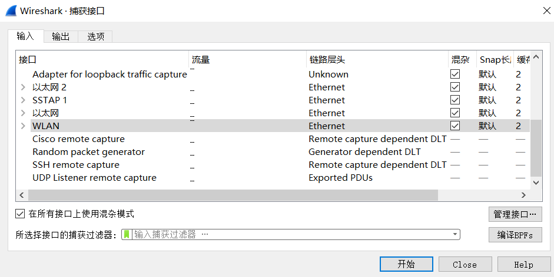

# Wireshark Lab 0x01-Intro

作为此书的第一个Lab，主要介绍了Wireshark的工作原理和基础的使用方法。

## 实验步骤
此处并未严格按照原任务分割，后面题目里的Step编号以修改。
### Step 1 Download
从官网( http://www.wireshark.org/download.html) 下载，直接安装。

### Step 2 选择合适的网卡进行捕获
这里我的电脑连接的WIFI，所以选择的是WLAN

### Step 3 开始抓包，并输入示例网址
当Wireshark正在运行时，输入URL：http://gaia.cs.umass.edu/wireshark-labs/INTRO-wireshark-file1.html ，并在浏览器中显示该页面。

### Step 4 停止抓包并分析

这里简单的介绍一下Wireshark界面的界面。主要分为三层，最上面是Packet List窗口，它列出了所有网络包。在Packet List中选定的网络包会详细地显示在中间的Packet Details窗口中。最底下是Packet Bytes Details窗口。

这里我们在过滤器输入http。

因为我之前已经访问过一次，所以这里返回的是304，第一次应该为200，当然也可能为其他state。

## 问题解答
### 1.List 3 different protocols that appear in the protocol column in the unfiltered packet-listing window in step 4 above
Packet List窗口中3种不同的协议，直接在protocol栏寻找即可。
Answer：TCP,UDP,OICQ

### 2.How long did it take from when the HTTP GET message was sent until the HTTP OK reply was received?
从发送 HTTP GET 消息到收到 HTTP OK 回复需要的时间
Answer = 3.036706-2.763368 s 
### 3.What is the Internet address of the gaia.cs.umass.edu (also known as wwwnet.cs.umass.edu)?  What is the Internet address of your computer?
直接看Source栏和Destination栏
Answer ：128.119.245.12 ，192.168.124.9
### 4.Print the two HTTP messages (GET and OK) referred to in question 2 above. To do so, select Print from the Wireshark File command menu, and select the “Selected Packet Only” and “Print as displayed” radial buttons, and then click OK.
打印出上面问题中提到的两条 HTTP 消息，这里就不演示了。

 
